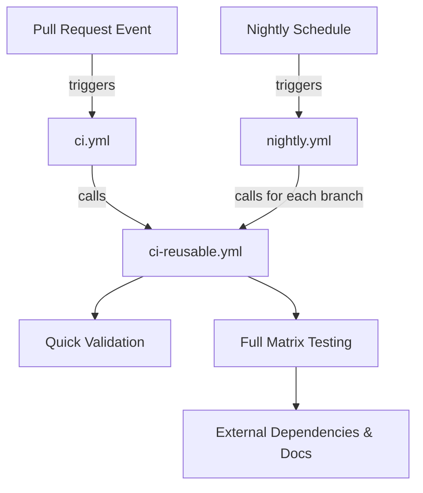
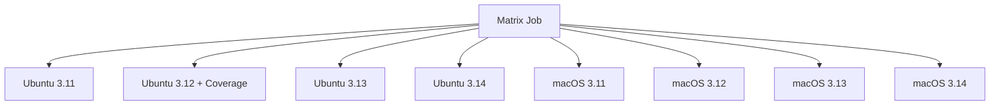
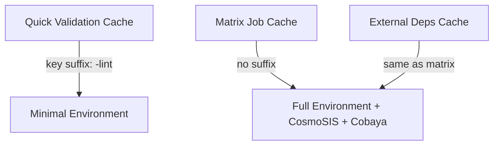
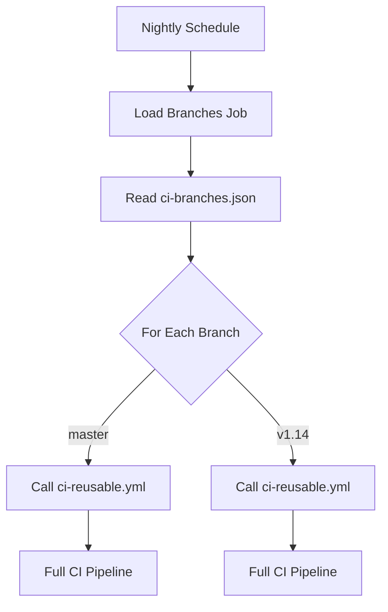
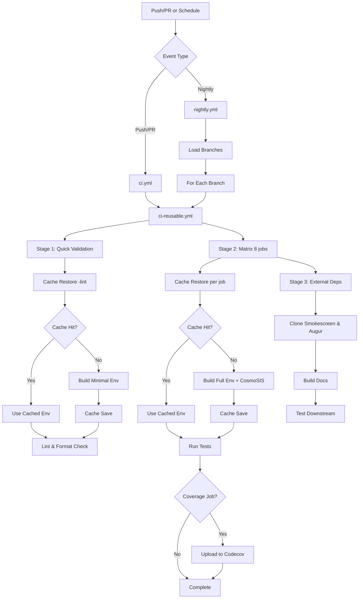

# Firecrown CI Workflows Documentation

This document describes the Continuous Integration (CI) workflows used in the Firecrown project.

## Overview

Firecrown uses a modular CI architecture with three workflow files:

1. **`ci.yml`** - Pull-request entry point workflow
2. **`ci-reusable.yml`** - Reusable workflow containing all job definitions
3. **`nightly.yml`** - Scheduled nightly testing across multiple branches



## Workflow Files

### 1. ci.yml - Pull Request Entry Point

**Trigger Events:**
- Pull requests to any branch

**What It Does:**
Simply calls `ci-reusable.yml` with default parameters (tests the current branch).

---

### 2. ci-reusable.yml - Reusable CI Pipeline

This is the core workflow containing all job definitions. It accepts inputs to test different branches.

**Inputs:**
- `ref` (optional): Git ref (branch/tag/SHA) to test. Defaults to the triggering ref.

**Secrets:**
- `CODECOV_TOKEN`: Token for uploading coverage reports to Codecov

**Environment Variables:**
- `CONDA_ENV`: `firecrown_developer`
- `CACHE_VERSION`: `34` (increment to invalidate all caches)

#### Architecture: Three-Stage Pipeline


---

## Stage 1: Quick Validation

**Job Name:** `quick-validation`

**Purpose:** Provide 2-3 minute feedback on common PR issues before running the full test matrix.

**Runs On:** `ubuntu-latest`

**Python Version:** 3.12

### Steps

1. **Checkout code**
   - Uses: `actions/checkout@v5`
   - Checks out the specified ref

2. **Setup Miniforge**
   - Uses: `conda-incubator/setup-miniconda@v4`
   - Python: 3.12
   - Activates `firecrown_developer` environment
   - Removes default conda channels

3. **Cache date computation**
   - Generates today's date in `YYYYMMDD` format
   - Used as part of cache key

4. **Compute environment.yml hash**
   - Calculates SHA256 hash of `environment.yml`
   - Used as part of cache key to detect dependency changes

5. **Restore Conda environment cache**
   - Uses: `actions/cache/restore@v5`
   - **Cache Key:** `conda-Linux-X64-py3.12-{date}-{env_hash}-v{CACHE_VERSION}-lint`
   - **Path:** `$CONDA/envs`
   - **Note:** The `-lint` suffix is critical - see "Cache Strategy" section below

6. **Validate cached Python pin** (if cache hit)
   - Verifies `${CONDA_PREFIX}/conda-meta/pinned` exists
   - Verifies pin content is `python 3.12.*`
   - Verifies interpreter major/minor is `3.12`
   - Fails immediately with a clear error message if any check fails

7. **Create Python pin and update environment** (if cache miss)
   - Writes `${CONDA_PREFIX}/conda-meta/pinned` with `python 3.12.*`
   - Runs `conda env update --name firecrown_developer --file environment.yml --prune`
   - Displays diagnostic information

8. **Save Conda environment cache** (if cache miss)
   - Uses: `actions/cache/save@v5`
   - **Path saved:** `$CONDA/envs` (entire conda environments directory)
   - **What's included in the cache:** all conda packages resolved from `environment.yml` by `conda env update`, the Python pin file `${CONDA_PREFIX}/conda-meta/pinned` (`python 3.12.*`), and compiled binaries/shared libraries/Python packages.
   - **What's NOT included:**
     - CosmoSIS Standard Library (never built in quick-validation)
     - Cobaya (never installed in quick-validation)
   - **On cache restore:** Jobs that restore this cache get a minimal environment sufficient for linting, but not for running tests that require CosmoSIS or Cobaya.

9. **Quick setup and linting**
   - Installs Firecrown in editable mode: `pip install --no-deps -e .`
   - Runs: `make lint` (black, flake8, mypy, pylint)

10. **Ensure clean Jupyter Notebooks**
   - Uses: `ResearchSoftwareActions/EnsureCleanNotebooksAction@1.1`
   - Verifies notebooks have cleared outputs

---

## Stage 2: Full Compatibility Matrix

**Job Name:** `firecrown-miniforge`

**Purpose:** Comprehensive testing across all supported OS and Python versions.

**Matrix Strategy:**
- **OS:** `ubuntu`, `macos`
- **Python versions:** `3.11`, `3.12`, `3.13`, `3.14`
- **Total combinations:** 8 (2 OS × 4 Python versions)
- **Special:** Ubuntu + Python 3.12 runs with coverage analysis

**Fail-fast:** `false` (all combinations run even if one fails)



### Steps

1. **Checkout code**
   - Uses: `actions/checkout@v5`

2. **Setup Miniforge**
   - Uses: `conda-incubator/setup-miniconda@v4`
   - Python: Matrix-specified version
   - Auto-activates environment

3. **Cache date computation**
   - Same as quick-validation

4. **Compute environment.yml hash**
   - Same as quick-validation

5. **Restore Conda environment cache**
   - Uses: `actions/cache/restore@v5`
   - **Cache Key:** `conda-{OS}-{ARCH}-py{VERSION}-{date}-{env_hash}-v{CACHE_VERSION}`
   - **Path:** `$CONDA/envs`
   - **Note:** No `-lint` suffix - this is the full environment cache

6. **Validate cached Python pin** (if cache hit)
   - Verifies `${CONDA_PREFIX}/conda-meta/pinned` exists
   - Verifies pin content matches matrix version: `python {VERSION}.*`
   - Verifies interpreter major/minor matches matrix version
   - Fails immediately with a clear error message if any check fails

7. **Create Python pin and update environment** (if cache miss)
   - Writes `${CONDA_PREFIX}/conda-meta/pinned` with `python {VERSION}.*`
   - Runs `conda env update --name firecrown_developer --file environment.yml --prune`

8. **Setup CosmoSIS and Cobaya** (if cache miss)
   - Sources `cosmosis-configure`
   - Builds CosmoSIS Standard Library in `$CONDA_PREFIX/cosmosis-standard-library`
   - Sets `CSL_DIR` environment variable
   - Installs Cobaya via pip: `pip install cobaya --no-deps`
   - **Note:** Sequential execution to avoid environment corruption

9. **Remove redundant rpath** (macOS only, if cache miss)
   - Fixes RPATH issues in `isitgr` library on macOS
   - Uses `install_name_tool` to remove redundant library paths
   - Verifies `isitgr` can be imported

10. **Save Conda environment cache** (if cache miss)
   - Uses: `actions/cache/save@v5`
   - **Path saved:** `$CONDA/envs` (entire conda environments directory)
   - **What's included in the cache:** all conda packages resolved from `environment.yml` by `conda env update`, the Python pin file `${CONDA_PREFIX}/conda-meta/pinned` (`python {VERSION}.*`), CosmoSIS Standard Library, Cobaya, and compiled binaries/shared libraries/Python packages.
   - **On cache restore:** Jobs that restore this cache get the complete environment with all packages, CosmoSIS, and Cobaya already installed and built. No rebuild needed.

11. **Setup Firecrown**
    - Sets `FIRECROWN_DIR` environment variable
    - Installs Firecrown in editable mode: `pip install --no-deps -e .`
    - Lists all conda packages

12. **Code quality checks**
    - Runs: `make lint`

13. **Run CI tests**
    - **If coverage job (Ubuntu 3.12):** `make test-ci`
      - Runs: `test-all-coverage`, `test-slow`, `test-integration`, `test-example`
      - Generates `coverage.xml`
    - **All other jobs:** `make test-all`
      - Runs: `test-slow`, `test-example`, `test-integration`, `test`

14. **Upload coverage to Codecov** (coverage job only)
    - Uses: `codecov/codecov-action@v5`
    - Uploads `coverage.xml`
    - Fails CI if upload fails
    - **Note:** GPG verification temporarily disabled due to upstream issue

---

## Stage 3: External Dependencies and Documentation

**Job Name:** `external-dependencies`

**Purpose:** Verify ecosystem integration and documentation build.

**Depends On:** `firecrown-miniforge` (runs only if matrix succeeds)

**Runs On:** `macos-latest`

**Python Version:** 3.13

### Steps

1. **Checkout code**
   - Uses: `actions/checkout@v5`

2. **Setup Miniforge**
   - Python: 3.13

3. **Cache date and environment hash**
   - Same as previous jobs

4. **Restore Conda environment cache**
   - **Cache Key:** `conda-macOS-{ARCH}-py3.13-{date}-{env_hash}-v{CACHE_VERSION}`

5. **Validate cached Python pin** (if cache hit)
   - Verifies `${CONDA_PREFIX}/conda-meta/pinned` exists
   - Verifies pin content is `python 3.13.*`
   - Verifies interpreter major/minor is `3.13`
   - Fails immediately with a clear error message if any check fails

6. **Create Python pin and update environment** (if cache miss)
   - Writes `${CONDA_PREFIX}/conda-meta/pinned` with `python 3.13.*`
   - Runs `conda env update --name firecrown_developer --file environment.yml --prune`

7. **Remove redundant rpath**
   - Fixes macOS RPATH issues for `isitgr`

8. **Setup CosmoSIS and Cobaya** (if cache miss)
   - Same as matrix job

9. **Save Conda environment cache** (if cache miss)
   - Uses: `actions/cache/save@v5`
   - **Path saved:** `$CONDA/envs` (entire conda environments directory)
   - **What's included in the cache:** all conda packages resolved from `environment.yml` by `conda env update`, the Python pin file `${CONDA_PREFIX}/conda-meta/pinned` (`python 3.13.*`), CosmoSIS Standard Library, Cobaya, and compiled binaries/shared libraries/Python packages.
   - **On cache restore:** Jobs that restore this cache get the complete environment with all packages, CosmoSIS, and Cobaya already installed and built. No rebuild needed.

10. **Clone Smokescreen**
    - Uses: `actions/checkout@v5`
    - Repository: `marcpaterno/smokescreen`
    - Branch: `adjust-to-firecrown-pr-586`
    - Path: `smokescreen/`

11. **Clone Augur**
    - Uses: `actions/checkout@v5`
    - Repository: `lsstdesc/augur`
    - Commit: `b59cfaf3dec90aa606a4add453a5a77e0c8ea942`
    - Path: `augur/`

12. **Build and verify tutorials and documentation**
    - Runs: `make docs-verify`
    - Builds tutorials with Quarto
    - Builds API documentation with Sphinx
    - Checks for broken links with `firecrown-link-checker`
    - Validates Python code blocks in tutorials
    - Validates Firecrown symbol references

13. **Install and test Augur**
    - Installs additional dependencies: `jinja2`, `tjpcov`
    - Installs Augur in editable mode
    - Runs Augur's test suite

14. **Install and test Smokescreen**
    - Installs Smokescreen in editable mode
    - Runs Smokescreen's test suite

---

## Cache Strategy

### Why Multiple Cache Keys?

The CI uses **separate cache keys** for different jobs to prevent cache corruption:



### Cache Key Components

**Quick Validation:**
```
conda-Linux-X64-py3.12-{date}-{env_hash}-v{CACHE_VERSION}-lint
```

**Matrix Jobs:**
```
conda-{OS}-{ARCH}-py{VERSION}-{date}-{env_hash}-v{CACHE_VERSION}
```

**Key Components:**
- **OS:** `Linux`, `macOS`
- **ARCH:** `X64`, `ARM64`
- **Python version:** `3.11`, `3.12`, `3.13`, `3.14`
- **Date:** `YYYYMMDD` format (daily cache refresh)
- **env_hash:** SHA256 of `environment.yml` (invalidates on dependency changes)
- **CACHE_VERSION:** Manual version number (global cache invalidation)

### Why the `-lint` Suffix?

**Problem:** Quick validation and matrix jobs run in parallel. If they shared the same cache key:
1. Quick validation finishes first (2-3 minutes)
2. Saves incomplete cache (no CosmoSIS/Cobaya)
3. Matrix job finishes later (8-12 minutes)
4. Tries to save complete cache, but key already exists
5. Next run: Matrix job gets incomplete cache → fails

**Solution:** Separate cache keys ensure each job saves/restores its own environment.

### Cache Invalidation

**Automatic invalidation when:**
- `environment.yml` changes (hash changes)
- Date changes (daily refresh)
- OS/Python version differs

**Manual invalidation:**
- Increment `CACHE_VERSION` in workflow file
- Forces all jobs to rebuild environments

### Cache Paths

**What's cached:**
- `$CONDA/envs` - All conda environments
  - Python packages
  - Compiled libraries
  - CosmoSIS Standard Library (matrix jobs only)
  - Cobaya (matrix jobs only)

**What's NOT cached:**
- Firecrown itself (installed fresh each run)
- Cloned repositories (Smokescreen, Augur)
- Test results
- Coverage reports

### Cache Retention Policy

**GitHub Actions cache retention:**
- Caches are automatically deleted after **7 days** of no access
- Caches are accessed when restored by a workflow run
- Total cache storage per repository: **10 GB limit**
- Oldest caches are evicted when limit is exceeded

**Implications for Firecrown:**
- Daily runs warm the current-day keys only (cache key includes date)
- Weekend gaps don't cause expiration (7-day window)
- Inactive branches may lose caches after 7 days
- Cache misses trigger full environment rebuild (~20-25 minutes)

---

## 3. nightly.yml - Multi-Branch Scheduled Testing

**Trigger Events:**
- Schedule: Daily at 1:47 AM UTC
- Manual: `workflow_dispatch` (for testing)

**Purpose:** Test all supported long-lived branches nightly to catch integration issues early.

### Architecture



### Jobs

#### Job 1: load-branches

**Runs On:** `ubuntu-latest`

**Steps:**
1. Checkout code
2. Read `.github/ci-branches.json`
3. Output branch list as matrix

**Output:** JSON array of branch names (e.g., `["master", "v1.14"]`)

#### Job 2: nightly

**Runs On:** Calls `ci-reusable.yml` (see Stage 1-3 above)

**Strategy:**
- **Matrix:** Branch list from `load-branches` job
- **Fail-fast:** `false`

**For Each Branch:**
- Calls `ci-reusable.yml` with `ref: {branch}`
- Runs complete CI pipeline (all 3 stages)
- Inherits secrets (including `CODECOV_TOKEN`)

### Branch Configuration

**Currently tested branches:**

Defined in `.github/ci-branches.json`:
```json
["master", "v1.14"]
```

**To modify tested branches:**

Edit `.github/ci-branches.json` only. No changes needed to workflow files.

---

## Python Version Pinning in CI

CI now pins interpreter major/minor directly inside each conda environment.

**Pinned file location:** `${CONDA_PREFIX}/conda-meta/pinned`

**Pinned file examples:**
```text
python 3.12.*
python 3.13.*
```

**Policy:**
1. On cache miss, the workflow writes the pinned file and runs `conda env update --prune`.
2. On cache hit, the workflow validates pinned file presence/content and interpreter version.
3. If validation fails on cache hit, the job fails immediately with a clear error.

`update_ci.py` and `env_tmp.yml` are no longer used.

---

## Makefile Targets Used in CI

### Linting

**`make lint`**
- Runs: `black --check`, `flake8`, `mypy`, `pylint`
- Runs in parallel
- Used by: Quick validation, all matrix jobs

### Testing

**`make test-ci`** (Coverage job only)
- Runs: `test-all-coverage`, `test-slow`, `test-integration`, `test-example`
- Generates `coverage.xml`

**`make test-all`** (Non-coverage jobs)
- Runs: `test-slow`, `test-example`, `test-integration`, `test`
- No coverage reporting

**`make test-all-coverage`**
- Runs core unit tests with coverage
- Uses `pytest -n auto` for parallelization
- Generates XML coverage report

**`make test-slow`**
- Runs tests marked with `@pytest.mark.slow`
- Uses `--runslow` flag

**`make test-integration`**
- Runs integration tests

**`make test-example`**
- Runs example tests

### Documentation

**`make docs-verify`**
- Runs: `docs-code-check`, `docs-symbol-check`, `docs-linkcheck`
- Builds tutorials with Quarto
- Builds API docs with Sphinx
- Validates code blocks and symbol references
- Checks for broken links

---

## Performance Characteristics

### Timing Estimates

| Job | Duration (Cache Hit) | Duration (Cache Miss) |
|-----|---------------------|----------------------|
| Quick Validation | 2-3 minutes | 8-10 minutes |
| Matrix Job (no coverage) | 8-12 minutes | 20-25 minutes |
| Matrix Job (with coverage) | 10-15 minutes | 25-30 minutes |
| External Dependencies | 10-15 minutes | 25-30 minutes |

### Total Pipeline Duration

**Best case (all caches hit):**
- Quick validation: 3 min (parallel with matrix)
- Matrix (8 jobs parallel): ~15 min
- External dependencies: ~15 min
- **Total: ~30 minutes**

**Worst case (all cache misses):**
- Quick validation: 10 min (parallel with matrix)
- Matrix (8 jobs parallel): ~30 min
- External dependencies: ~30 min
- **Total: ~60 minutes**

### Cache Hit Rates

**Expected cache hit rates:**
- **Same day, no environment.yml changes:** ~95%
- **New day, no environment.yml changes:** 0% (cache key includes date)
- **After environment.yml change:** 0% (hash changes)

---

## Troubleshooting

### Cache Issues

**Problem:** Jobs fail with "package not found" errors

**Solution:**
1. Check if `environment.yml` was recently modified
2. Increment `CACHE_VERSION` in `ci-reusable.yml`
3. Wait for next run to rebuild caches

**Problem:** Cache expired (7-day retention)

**Solution:**
- Automatic - next run will rebuild and cache
- Expect longer build time (~20-25 minutes)
- Subsequent runs will use fresh cache

**Problem:** Quick validation passes but matrix fails

**Solution:**
- This is expected - quick validation doesn't run full tests
- Check matrix job logs for actual failure

### macOS-Specific Issues

**Problem:** `isitgr` import fails on macOS

**Solution:**
- The "Remove redundant rpath" step should fix this
- If it persists, check if `install_name_tool` command needs updating

### Coverage Upload Failures

**Problem:** Codecov upload fails

**Solution:**
1. Check if `CODECOV_TOKEN` secret is set
2. Verify `coverage.xml` was generated
3. Check Codecov service status

---

## Best Practices for Developers

### Before Pushing

Run locally:
```bash
make lint          # Quick feedback
make test          # Fast tests
make test-all      # Full test suite (optional)
```

### Interpreting CI Results

1. **Quick validation fails:** Linting/formatting issue - fix locally
2. **Matrix job fails:** Test failure - check specific OS/Python combination
3. **External dependencies fail:** Integration issue - check downstream projects

### When to Increment CACHE_VERSION

- After major dependency updates
- When cache corruption is suspected
- When switching between incompatible environments
- When you need to force all jobs to rebuild environments

**Note:** Incrementing `CACHE_VERSION` invalidates all caches globally. Next CI run will be slower (~20-25 minutes per job) as environments rebuild.

### Adding New Python Versions

1. Update matrix in `ci-reusable.yml`:
   ```yaml
   python-version: ["3.11", "3.12", "3.13", "3.14", "3.15"]
   ```
2. No other changes needed

---

## Workflow Diagram (Complete)



---

## Summary

The Firecrown CI system is designed for:
- **Fast feedback:** Quick validation in 2-3 minutes
- **Comprehensive testing:** 8 OS/Python combinations
- **Ecosystem validation:** Tests with downstream projects
- **Maintainability:** Single source of truth for job definitions
- **Flexibility:** Easy to add new branches or Python versions

The caching strategy balances speed with reliability, and the three-stage pipeline ensures efficient resource usage while maintaining thorough testing coverage.
