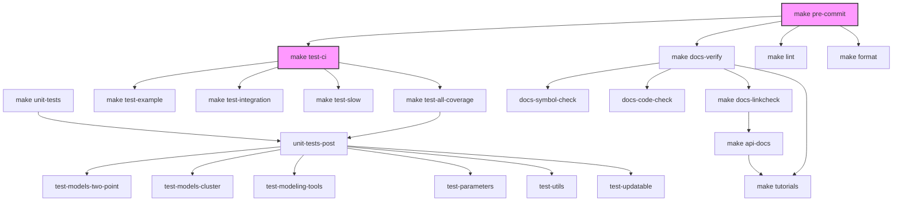

# Contributing to Firecrown

Thank you for your interest in contributing to Firecrown! This document provides guidelines and workflows to help you get started.

## Development Environment Setup

We recommend using `conda` (or `mamba`/`miniforge`) to manage your development environment.

1. **Clone the repository:**
   ```bash
   git clone https://github.com/LSSTDESC/firecrown.git
   cd firecrown
   ```

2. **Create and activate the environment:**
   ```bash
   conda env create -f environment.yml
   conda activate firecrown_developer
   ```

3. **Install Firecrown in development mode:**
   ```bash
   make install
   ```

## Recommended Developer Workflow

To maintain high code quality and consistency, we use several automated tools. We recommend following this workflow during development:

| Target | Description | When to run |
| :--- | :--- | :--- |
| `make format` | Automatically format all code using `black` | Frequently during development |
| `make lint -j` | Run all linters (`black`, `flake8`, `mypy`, `pylint`) in parallel | Before every commit |
| `make test -j` | Run fast unit tests in parallel | Regularly during development |
| `make unit-tests -j` | Run all unit tests with 100% per-component coverage check | Before pushing |
| `make test-ci` | Run the full test suite exactly as the CI system does | Final check before pushing |
| `make docs -j` | Build and verify all documentation (tutorials + API) | When changing tutorials or docstrings |
| `make pre-commit` | A comprehensive check: format, lint, docs-verify, and full tests | Recommended pre-push check |

> [!TIP]
> Always use the `-j` flag (e.g., `make -j lint`) to take full advantage of parallel execution. The `Makefile` automatically detects the number of available CPUs.

### Target Relationships

The following diagram shows how the key `Makefile` targets depend on each other:



## Pull Request Process

1. **Create a Branch**: Always work on a new branch for your feature or bug fix.
2. **Write Tests**: Ensure your changes are covered by unit tests. We aim for 100% coverage on new code.
3. **Verify Locally**: Run `make pre-commit` to ensure everything is in order.
4. **Submit PR**: Once your tests pass locally, submit a Pull Request to the `master` branch.
5. **CI Pipeline**: Our CI system will run the full test matrix on Ubuntu and macOS with various Python versions. Your PR must pass all CI checks before it can be merged.

## Coding Style

- Use `black` for formatting.
- Follow PEP 8 guidelines (enforced by `flake8`).
- Use type hints wherever possible (checked by `mypy`).
- Ensure `pylint` passes without warnings in the relevant packages.
