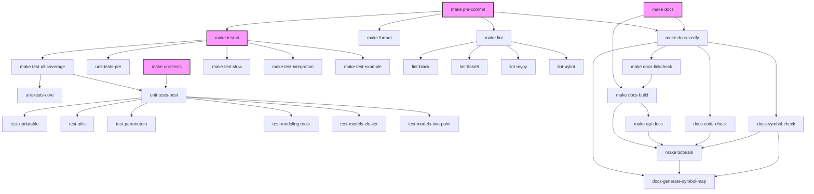
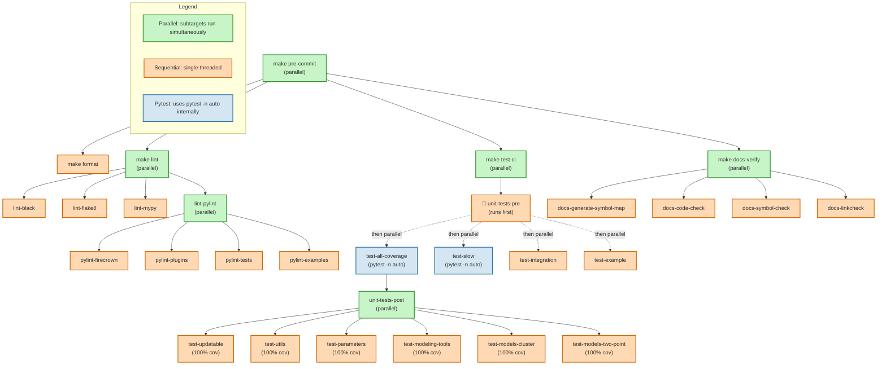

# Firecrown Build System and CI Internals

This document describes the internal structure of the `Makefile` build system
and the CI pipeline.
It is intended for maintainers and contributors who need to understand or
modify these systems.
For general contribution guidance, see [CONTRIBUTING.md](CONTRIBUTING.md).

## Target Relationships

The following diagram shows how the key `Makefile` targets depend on each other:



## Parallelism Architecture

The Makefile supports two levels of parallelism:

- **Make-level**: Multiple independent targets run simultaneously (enabled by default with `-j`)
- **Pytest-level**: Test suites use `pytest -n auto` to parallelize individual test execution

The following diagram shows which targets support parallel execution of their subtargets:



**Key Points:**

- **Green boxes**: Run subtargets in parallel
- **Orange boxes**: Run sequentially (no internal parallelism)
- **Blue boxes**: Use pytest's `-n auto` for parallel test execution
- **Barrier (🚧)**: `unit-tests-pre` runs first, then its dependent targets run in parallel
- **Tutorials**: Specifically run sequentially due to Quarto's shared asset limitations

## CI System Architecture

Firecrown's CI is split across three files in `.github/`.
This structure keeps all job definitions in one place
and the list of supported long-lived branches in exactly one place,
while allowing both PR and nightly scheduled runs
to target multiple branches without any duplication.

| File | Purpose |
| :--- | :--- |
| `ci-branches.json` | **The single source of truth** for which long-lived branches are tested nightly. Edit only this file to add or remove a branch. |
| `workflows/ci-reusable.yml` | The single source of truth for all CI job definitions (all three stages). Called by the other two workflows. Never triggered directly by GitHub events. |
| `workflows/ci.yml` | Triggered on every `pull_request` event. Calls `ci-reusable.yml` unconditionally. There is no push trigger: all commits to long-lived branches arrive via merged PRs (which have already run CI), and the nightly workflow covers ongoing health checks. |
| `workflows/nightly.yml` | Triggered by the daily cron schedule. Reads `ci-branches.json` at runtime to build the branch matrix, then calls `ci-reusable.yml` once per branch. |

### How it works

`ci-reusable.yml` accepts an optional `ref` string input.
When `ref` is empty (the default), `actions/checkout` falls back to the commit
that triggered the calling workflow.
When `ref` is a branch name (as supplied by `nightly.yml`),
all checkout steps test that specific branch's code.

Because GitHub always executes scheduled workflows from the repository's
**default branch** (`master`), `nightly.yml` must explicitly supply `ref`
to test any branch other than `master`.
The reusable workflow definition used is always the one on `master`,
but the source code and `environment.yml` checked out during testing
come from the branch named in `ref`.

### Adding or removing a supported branch

Edit `.github/ci-branches.json` only — for example, to add `v1.15`:

```json
["master", "v1.14", "v1.15"]
```

No changes to any workflow file are needed.
