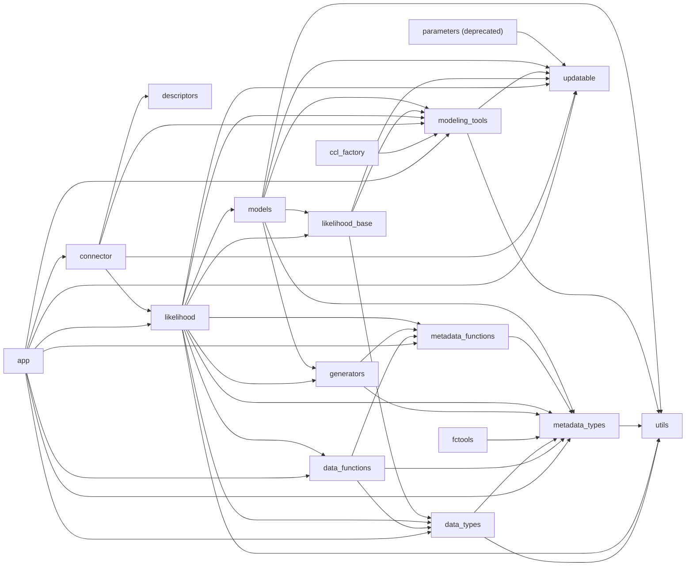

# Firecrown Package Dependency Analysis

## Updated: 2026-08-19 based on the code in commit b972fc501516d8df5ee88a340c42d73df1623253

This document describes the direct dependencies between top-level `firecrown.*` packages
and the top-level module `firecrown.likelihood_base`.
It is based on imports in `firecrown/**/*.py`.
It excludes third-party dependencies, same-package internal imports, and string or docstring references that are not executable imports.

## Scope

The analysis is about dependencies between Firecrown packages, not about external packages such as `numpy`, `pyccl`, or `sacc`.
The `app/examples` modules are included because they are shipped inside the `firecrown.app` package and therefore contribute to that package's dependency surface.

## Package Dependency Diagram

The diagram below shows direct imports between pubic Firecrown packages and modules.
Each node is a top-level public Firecrown namespace (package or module).
Packages and modules with no outgoing edges are still shown so the leaf packages remain visible.
An arrow from `A` to `B`indicates that some file under `A` contains an absolute Firecrown import that resolves to `B`.
For example, `A` may contain any or all of the following:

```python
import firecrown.B...
from firecrown.B import ...
from firecrown import B)
```



## Direct Package Dependencies

- `app` -> `connector`, `data_functions`, `data_types`, `likelihood`, `metadata_functions`, `metadata_types`, `modeling_tools`, `updatable`.
  The `connector` dependency is introduced by `firecrown.app.analysis`.
  There is no top-level `firecrown.analysis` package.
  The active analysis code lives under `firecrown.app.analysis`.
- `ccl_factory` -> `modeling_tools`.
  This package is a deprecated compatibility re-export.
- `connector` -> `descriptors`, `likelihood`, `modeling_tools`, `updatable`.
- `data_functions` -> `data_types`, `metadata_functions`, `metadata_types`.
- `data_types` -> `metadata_types`, `utils`.
- `descriptors` -> none.
- `fctools` -> `metadata_types`.
  This package has no dependency on `firecrown.analysis`.
- `generators` -> `metadata_functions`, `metadata_types`.
- `likelihood` -> `data_functions`, `data_types`, `generators`, `likelihood_base`, `metadata_functions`, `metadata_types`, `modeling_tools`, `models`, `updatable`, `utils`.
- `likelihood_base` -> `data_types`, `modeling_tools`, `updatable`.
- `metadata_functions` -> `metadata_types`.
- `metadata_types` -> `utils`.
- `modeling_tools` -> `updatable`, `utils`.
- `models` -> `generators`, `likelihood_base`, `metadata_types`, `modeling_tools`, `updatable`, `utils`.
- `parameters` -> `updatable`.
  This package is a deprecated compatibility re-export.
- `updatable` -> none.
- `utils` -> none.

## Dependency Notes By Package

### `app`

`app` spans the CLI entry point, example generators, SACC helpers, and the framework configuration builders in `firecrown.app.analysis`.
That package depends on `connector` through `firecrown.app.analysis._cobaya` and `firecrown.app.analysis._numcosmo`.
It depends on `likelihood` and `modeling_tools` broadly across `analysis`, `examples`, and the SACC commands.
Its SACC view/helpers also import `data_functions`, `data_types`, and
`metadata_types`, and use `metadata_functions` for metadata extraction.
Its only direct dependency on `updatable` is in the example template that registers a custom power-spectrum modifier parameter.

### `data_types`, `data_functions`, `metadata_functions`, and `metadata_types`

These four packages form a mostly layered stack.
`metadata_types` depends only on `utils`.
`metadata_functions` depends on `metadata_types`.
`data_types` depends on `metadata_types` and `utils`.
`data_functions` depends on `data_types`, `metadata_functions`, and `metadata_types`.
There is no direct reverse dependency from `metadata_types` back into `metadata_functions`.

### `generators`

`generators` has direct imports limited to `metadata_functions` and `metadata_types`.
It does not directly import `data_types`, `modeling_tools`, or `updatable`.

### `likelihood`

`likelihood` is the most connected active package.
It depends on the metadata and data packages, on `modeling_tools`, on `models`, on `updatable`, and on `utils`.
It also depends directly on `likelihood_base` for core base types.
Its `factories` subpackage adds a dependency on `data_functions`.

### `likelihood_base`

`likelihood_base` is a shared top-level module.
It centralizes base classes and types used by `likelihood` and selected consumers in
`models`, and depends on `data_types`, `modeling_tools`, and `updatable`.

### `modeling_tools` and `models`

`models` depends on `modeling_tools` in the `models.two_point` subpackage.

### `parameters` and `updatable`

`parameters` is a compatibility layer that re-exports objects from `updatable`.
The active implementation lives in `updatable`.
The old `parameters` package should not be used for new code.

## Circular Dependencies

There are no confirmed runtime package-layer cycles among the top-level packages and
`likelihood_base` in the current import graph.

There is a directional type-level coupling from `models.two_point` to
`likelihood_base` via `TYPE_CHECKING` imports.

### Deprecated Compatibility Layer

`parameters` depends on `updatable`.
There is no reverse runtime import from `updatable` back into `parameters`.
That means the deprecated compatibility layer does not form a real import cycle.

## Cross-Package Use Of Non-Public APIs

No cross-package imports into underscore-prefixed modules were identified in the
current code.

Imports such as `firecrown.likelihood.factories._models` importing `firecrown.likelihood._base` are not listed here because they stay within the same top-level package.

## Architectural Summary

The cleanest leaves in the dependency graph are `utils`, `descriptors`, and `updatable`.
`metadata_types` and `metadata_functions` form a relatively clean metadata layer on top of them.
`data_types` and `data_functions` build on that metadata layer.
`likelihood`, `likelihood_base`, `modeling_tools`, and `models` carry most of the
cross-cutting dependencies.

## Source Files Used To Confirm The Key Edges

- `firecrown/app/cosmology.py`
- `firecrown/app/analysis/_cobaya.py`
- `firecrown/app/analysis/_numcosmo.py`
- `firecrown/app/sacc/_view.py`
- `firecrown/app/sacc/_utils.py`
- `firecrown/connector/mapping.py`
- `firecrown/data_types/_measurement.py`
- `firecrown/data_functions/_types.py`
- `firecrown/generators/_inferred_galaxy_zdist.py`
- `firecrown/likelihood/_two_point.py`
- `firecrown/likelihood/factories/_models.py`
- `firecrown/likelihood_base.py`
- `firecrown/metadata_functions/_measurement_utils.py`
- `firecrown/metadata_types/_utils.py`
- `firecrown/modeling_tools/_modeling_tools.py`
- `firecrown/models/two_point/_theory.py`
- `firecrown/models/two_point/_power_spectrum.py`
- `firecrown/fctools/measurement_compatibility.py`
- `firecrown/parameters/__init__.py`

*This analysis reflects the repository state on 2026-08-19.*
